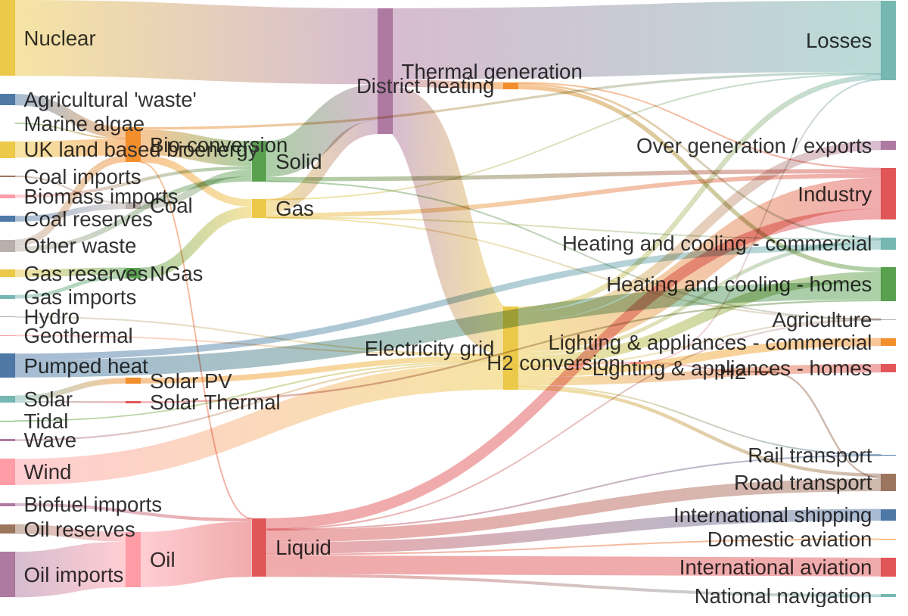

# Interesting syntax

* DGX
* H100
* Base Command Manager
* DgxOs


| name      | Description                        |
| --------- | ---------------------------------- |
| Jekyll    | Static Site generator              |
| Chirpy    | template for Jekyll (Simple blogs) |


hhh


hhh

{: .left w="300" h="150" }
Here is a long text that will be repeated serveral lines in order to see the picture to fit around on the left side. If this works it is a little miracle but let us all give it a try because seeing is beliveing. Also A good test on a real browser window will be needed, but let me see in preview first.

hhh

{: .right w="200" h="150" }

Here is a long text that will be repeated serveral lines in order to see the picture to fit around on the right side. If this works it is a little miracle but let us all give it a try because seeing is beliveing. Also A good test on a real browser window will be needed, but let me see in preview first.

hhh

This is my [link to the top 20 post]() that I mentioned earlier.

#🏅 Rank

## 🏅 Rank Nyhed
## ✅ Rank 💯

### 🏅 Rank

Can this do


#### 🏅 Rank

🏅 Rank


```bash
pwd
ls -l 
who
```

~~hey~~


Nu er den der mere mere
