# Interesting syntax

* DGX
* H100
* Base Command Manager
* DgxOs


| name      | Description                        |
| --------- | ---------------------------------- |
| Jekyll    | Static Site generator              |
| Chirpy    | template for Jekyll (Simple blogs) |


hhh


hhh

{: .left w="300" h="150" }
Here is a long text that will be repeated serveral lines in order to see the picture to fit around on the left side. If this works it is a little miracle but let us all give it a try because seeing is beliveing. Also A good test on a real browser window will be needed, but let me see in preview first.

hhh

{: .right w="200" h="150" }

Here is a long text that will be repeated serveral lines in order to see the picture to fit around on the right side. If this works it is a little miracle but let us all give it a try because seeing is beliveing. Also A good test on a real browser window will be needed, but let me see in preview first.

hhh

This is my [link to the top 20 post]() that I mentioned earlier.

#🏅 Rank

## 🏅 Rank Nyhed
## ✅ Rank 💯

### 🏅 Rank

Can this do


#### 🏅 Rank

🏅 Rank and

Table

| 🏭 Overview | 📆 Status | 🌐 Link | 📝 Notes
|:---|:------------------|:-----------|:--------------------|
| **Cantaloop Technology** | **Under construction** | cantaloop.dk | Landing page company |
| **Cantaloop Blog** | Running | blog.cantaloop.dk | this site |
| **Cantaloop Dashboard** | Running | kibana.cantaloop.dk | traffic dashboard |
| **Cantaloop LLM** | Running | llm.cantaloop.dk | local llm |
| **Cantaloop Nextcloud** | Running | nextcloud.cantaloop.dk | files locally |
| **Orchestrator** | **Under construction** | orchestrator.dk | Multi tenant, Multi Agent, Multi Vendor |
| **Agentic AI prototypes** | **Under construction** | orchestrator.dk/a1.html | First prototype |


```bash
pwd
ls -l 
who
```

> Dette virker altid uden ekstra konfiguration.
{: .prompt-tip }


~~hey~~

https://getemoji.com/

[Her you can copy emoji icons](https://getemoji.com/)

Some here = 📌🔎✅💯🔜⛔️

[🏠 Go to Home](https://cantaloop.dk)


Nu er den der mere mere

Her kommer lidt flere forslag
Punktopstillinger:

Jekyll
: En statisk sidegenerator skrevet i Ruby.

Chirpy
: Et fantastisk tema til Jekyll med indbygget mørk tilstand.


Bruge prompts sådan her

> {: .prompt-tip } Dette er et smart tip til din læser.

> {: .prompt-info } Her er noget vigtig information.

> {: .prompt-warning } Pas på med at slette din `_config.yml`!

> {: .prompt-danger } Dette er en kritisk fejlmeddelelse.

Eller sådan her 

> Dette er et smart tip til din læser.
{: .prompt-tip }

> Her er noget vigtig information.
{: .prompt-info }

> Pas på med at slette din `_config.yml`!
{: .prompt-warning } 

> Dette er en kritisk fejlmeddelelse.
{: .prompt-danger } 

MD er fantastisk til at skrive dokumentation.

*[MD]: Markdown

Og en dynamisk mermaid

```mermaid
graph TD;
    A[Start på Blog] --> B{Bruger du Chirpy?};
    B -- Ja --> C[Din blog ser vild ud];
    B -- Nej --> D[Gå til Chirpy på GitHub];
```



Er det noget?


