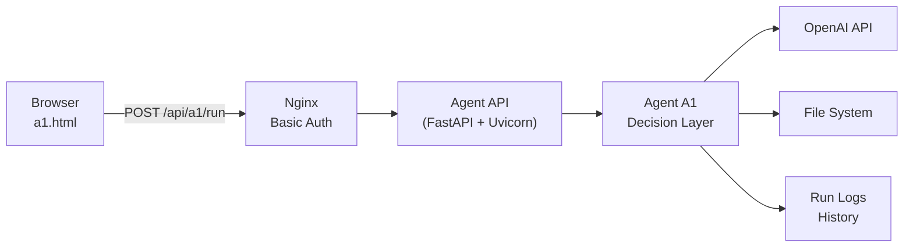

# 🌍 Project orchestrator - Agentic AI prototype

## Overview

Agent A1 is the first working prototype in a small agent framework whose purpose is **learning by building**.

The goal was not to create a “smart” agent, but a **concrete, observable, repeatable system** that demonstrates how modern LLM-based agents can be:

- controlled
- executed
- audited
- extended
- and compared across providers (OpenAI today, Gemini next)

Agent A1 performs a deliberately simple task:  
**moving files from one folder to another**, while logging *every decision and execution step*.

Simplicity is a feature here.

---

## Design Principles

The system is built around a few explicit principles:

1. **Decision ≠ Execution**  
   The LLM decides *what should happen*; deterministic code performs the action.

2. **Everything is observable**  
   Every run produces a structured run object with inputs, outputs, timestamps, and duration.

3. **Agents are replaceable**  
   Agent A1 (OpenAI) is intentionally built so Agent A2 (Gemini) can be dropped in with minimal changes.

4. **Infrastructure stays boring**  
   Standard Linux, Python, Nginx, and GitHub Pages. No hidden magic.

---

## High-Level Architecture



---

## Component Breakdown

### Frontend (a1.html)

The frontend is intentionally minimal:

- Static HTML
- Three buttons:
  - **Run agent**
  - **Show status**
  - **Show history**
- Uses `fetch()` against a small REST API
- Protected via **Nginx basic authentication**

There is no frontend framework and no state beyond what the backend returns.

---

### Reverse Proxy (Nginx)

Nginx serves three purposes:

1. Basic authentication (`.htpasswd`)
2. TLS termination (not shown here)
3. Reverse proxy to the agent API

This keeps the agent runtime fully private while still being web-accessible.

---

### Agent API (FastAPI + Uvicorn)

The API exposes a minimal surface:

- `POST /api/a1/run`
- `GET  /api/a1/status`
- `GET  /api/a1/history`

Each request triggers or queries **exactly one agent run**.

Uvicorn runs the API as a long-lived service on the server.

---

## Agent A1 Runtime

Agent A1 itself is split into **four explicit phases**:

### 1. Observe

The agent inspects the current state of the filesystem:

- source folder
- target folder
- list of files

No assumptions are made.

---

### 2. Decide (LLM)

The observed state is turned into a structured prompt and sent to the OpenAI API.

The model returns a **pure decision object**, for example:

```json
{
  "status": "moved",
  "actions": [
    "Move test8.txt from source folder to target folder"
  ]
}
```

The LLM **never touches the filesystem directly**.

---

### 3. Execute (Deterministic Code)

The Python runtime:

- validates the decision
- performs the file operations
- verifies the result

If execution fails, the run is marked as failed — regardless of what the model suggested.

---

### 4. Log (Run Object)

Each execution produces **one structured run record**:

```json
{
  "run_id": "7c3d2571-78ab-40f6-a8fb-02ec81ac19ee",
  "agent": "a1",
  "model": "openai:gpt-4.1-mini",
  "status": "moved",
  "input_files": ["test8.txt"],
  "actions": [
    "Moved test8.txt from source folder to target folder"
  ],
  "timestamp": "2026-01-09T10:23:48.288710+00:00",
  "duration_sec": 2.668
}
```

Only **one log entry per run** is written.

This makes the system auditable, debuggable, and comparable across agents.

---

## Scheduling and Automation

Because Agent A1 is just a normal executable process, it can be:

- triggered via the web UI
- called via API
- executed from CLI
- scheduled via `cron`

No special orchestration layer is required at this stage.

---

## Why This Matters

This prototype demonstrates a few important ideas:

- LLMs are best used as **decision engines**, not executors
- Agent systems become understandable only when **runs are first-class objects**
- Observability is more important than intelligence in early agent systems
- Provider comparisons (OpenAI vs Gemini) are only meaningful when the surrounding system is identical

---

## Next Steps

Planned extensions include:

- **Agent A2**: identical logic, powered by Gemini instead of OpenAI
- Side-by-side comparison of run quality and latency
- Multiple agents under a shared orchestrator
- More complex tasks with the same runtime pattern

Agent A1 is intentionally simple — and that is exactly why it works.

---

*This post documents the first working milestone.  
Complexity will be added only when the system itself demands it.*

---

_Last updated: January 2026_  
_Source: Cantaloop Aps._
