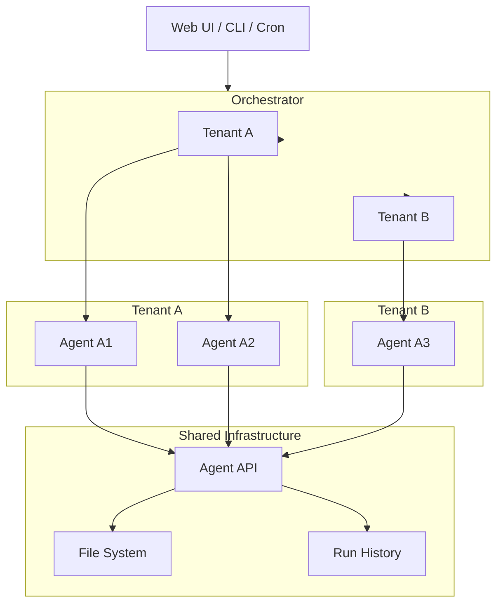

## 🏅 Setting up SaaS for application with orchestrator and Agentic AI projects

*Here I will describe and document my journey with setting up software to be used for experiments in relation to project orchestrator.
Steps include overview and details that is relevant from building core and secure foundation to setting up needed software stack and develop and deploy multiple applications.*

---

| 🏭 Overview | 📆 Status | 🌐 Link | 📝 Notes
|:--:|:------------------|:-------------|:--------------------|
| **SaaS Orchestrator** | **Setup January/2026** | **[Orchestrator]()** | orchestrator.dk |
| **SaaS Agentic AI prototypes** | **Setup January/2026** | **[Agentic]()** | orchestrator.dk/a1.html |
| **SaaS Agentic AI prototypes** | **Setup January/2026** | **[ServerSide]()** | orchestrator.dk/a1.html |
| **Install next** | To come January/2026 | WIP | with notes  |

---

## Initial Architecture overview. 

This diagram shows how the system can evolve from a single-agent prototype into a multi-tenant orchestrator without major architectural changes.

At the top level, users or automation systems (web UI, CLI, cron jobs) interact with a central orchestrator. The orchestrator routes requests to the appropriate tenant context.

Each tenant owns one or more agents. For example, Tenant A may run both Agent A1 and Agent A2, while Tenant B runs a different agent with its own configuration and purpose.

All agents share the same underlying infrastructure: a common API layer, filesystem access, and centralized run history. Isolation is achieved at the configuration and routing level rather than by duplicating infrastructure.

This design supports “mini sovereign agents” — independently controlled agents operating within a shared platform — while remaining lightweight and understandable.

---

_Last updated: January 2026_  
_Source: Cantaloop Aps._
