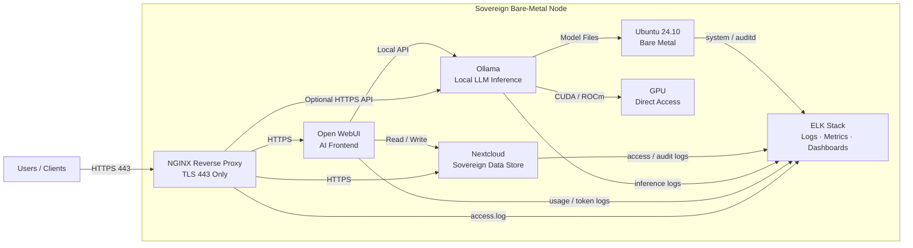

# 🧊 IBM Sovereign Core vs 🥕 Cantaloop Sovereign Core  
*A tale of platforms, bare metal, and radical simplicity*

---

## TL;DR 🚀

- **:contentReference[oaicite:0]{index=0} Sovereign Core** is a **platform**: powerful, integrated, complex.
- **Cantaloop Sovereign Core** (this blog) is a **pattern**: bare metal, explicit, auditable, boring in the best way.
- Both solve *sovereignty* — but from opposite ends of the abstraction spectrum.

This post explains why **less platform can mean more sovereignty**.

---

## 🧠 What is IBM Sovereign Core?

**IBM Sovereign Core** is a software foundation designed to help governments and regulated industries deploy **AI and cloud workloads** under strict sovereignty constraints.

At a high level, it provides:

- A customer-controlled **cloud-like control plane**
- Integrated **governance, audit, and compliance**
- AI-ready infrastructure
- Heavy use of Kubernetes and virtualization
- Deep integration with Red Hat technologies

It answers the question:

> *“How do we run a sovereign cloud inside our borders?”*

This is a valid — and often necessary — approach.

---

## 🥕 What is Cantaloop Sovereign Core?

**Cantaloop Sovereign Core** is not a product.  
It’s not a platform.  
It’s not even software.

It’s an **architectural stance**:

> *“One project. One machine. One boundary.”*

Instead of abstracting sovereignty *up*, we enforce it *down* — at the physical and OS level.

---

## 🧱 Cantaloop Sovereign Core – Architecture

### Core principles 🎯

- ❌ No virtualization  
- ❌ No Kubernetes  
- ❌ No shared control plane  
- ✅ Bare metal only  
- ✅ Linux as the contract  
- ✅ One physical server per project  

---

### 🔐 Ingress & Security

- **NGINX** as the *single ingress point*
- TLS everywhere (443 only)
- Strong ciphers, rate limiting, explicit routing
- No direct access to internal services

NGINX is the **sovereign choke point**.

---

### 🤖 AI Stack

- **Ollama**  
  - Local inference
  - Open-source models
  - Direct GPU access
  - No external API calls

- **Open WebUI**  
  - Self-hosted AI interface
  - Authentication enabled
  - Accessed only via NGINX

No schedulers. No orchestration. No surprises.

---

### 📁 Data Layer

- **Nextcloud**
  - Sovereign document store
  - Auditable access
  - Controlled data ingress for AI (RAG, uploads)
  - Lives on the *same physical machine*

This replaces:
- Cloud object storage ☁️
- Ad-hoc file transfers ❌
- Shadow IT data paths 🚫

---

### 📊 Observability & Audit

- Full **ELK stack**
- Centralized logs from:
  - NGINX (access + TLS)
  - Open WebUI (usage + tokens)
  - Ollama (inference)
  - Nextcloud (file + user audit)
  - OS / auditd

Yes — **token traffic is observable**.  
And no — nothing leaves the box.

---

---

## 🔍 Side-by-side comparison

| Capability | 🧊 IBM Sovereign Core | 🥕 Cantaloop Sovereign Core |
|---------|--------------------|---------------------------|
| Philosophy | Platform | Pattern |
| Deployment model | Cloud-like | Appliance-like |
| Virtualization | Required | ❌ |
| Kubernetes | Core dependency | ❌ |
| Physical isolation | Partial | ✅ |
| Control plane | Centralized | None (by design) |
| AI runtime | Abstracted | Direct GPU |
| Auditability | Tool-driven | Structural |
| Explainability | Complex | Trivial |
| Sovereignty story | Strong | **Extremely strong** |

---

## 🧠 The key insight

**Sovereignty is not created by platforms.  
It is created by boundaries.**

IBM builds sovereignty by *adding layers*.  
Cantaloop builds sovereignty by *removing them*.

Neither is “better” in all cases — but for:

- Predictable workloads
- Long-lived AI services
- Strict audit requirements
- Low tolerance for ambiguity

…the **bare-metal approach wins on clarity, cost, and control**.

---

## 🗣️ The one sentence that disarms auditors

> *“This is a single-tenant, bare-metal sovereign AI node with encrypted ingress, centralized audit logging, and token-level observability. It intentionally avoids virtualization and orchestration to reduce attack surface and maximize data locality.”*

Try saying that about a Kubernetes cluster 😄

---

## 🧭 When to choose which?

### Choose IBM Sovereign Core if:
- You need multi-tenancy
- You need elastic scaling
- You need a vendor-supported platform
- You are already deeply invested in cloud-native ops

### Choose Cantaloop Sovereign Core if:
- You value determinism over elasticity
- You want **one box = one answer**
- You prefer Linux over platforms
- You like sleeping at night 💤

---

## 🛠️ TODO / Next steps

- [ ] Add **RAG pipeline** (Nextcloud → embeddings → Ollama)
- [ ] Introduce **token quotas & governance**
- [ ] Add **mTLS** between NGINX and internal services
- [ ] Implement **log hashing + WORM storage**
- [ ] Define **air-gapped model import workflow**
- [ ] Formalize **“Sovereign Node v1” spec**
- [ ] Write a **threat model & compliance mapping**
- [ ] Explore **multi-node federation (without Kubernetes)**

---

## 🧩 Final thought

Not everything needs to be a platform.  
Sometimes the most sovereign system is the one you can draw on a whiteboard — and explain in five minutes.

🥕 **Cantaloop Sovereign Core** is intentionally boring.  
And that’s exactly why it works.

---

_Last updated: January 2026_  
_Source: Cantaloop Aps._
