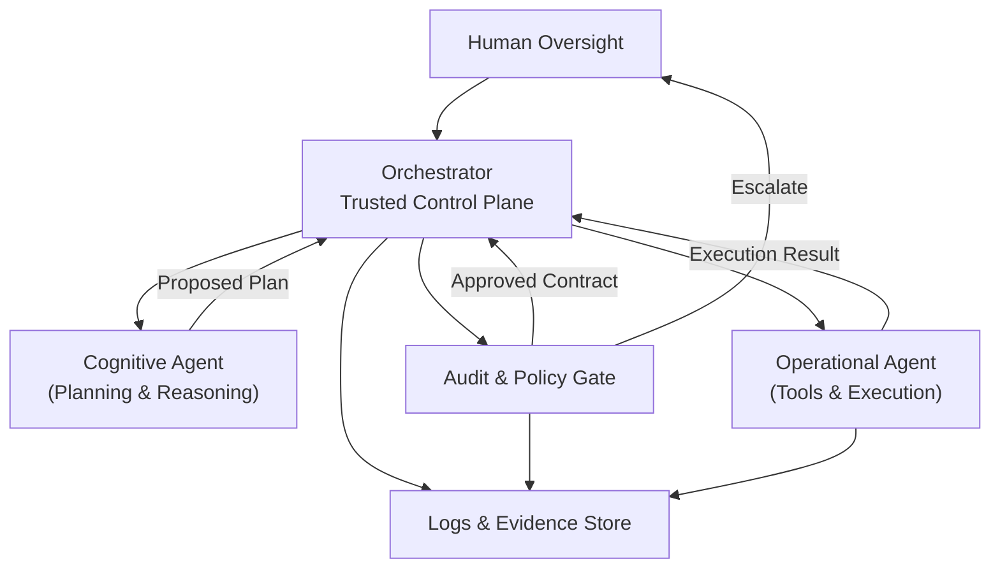
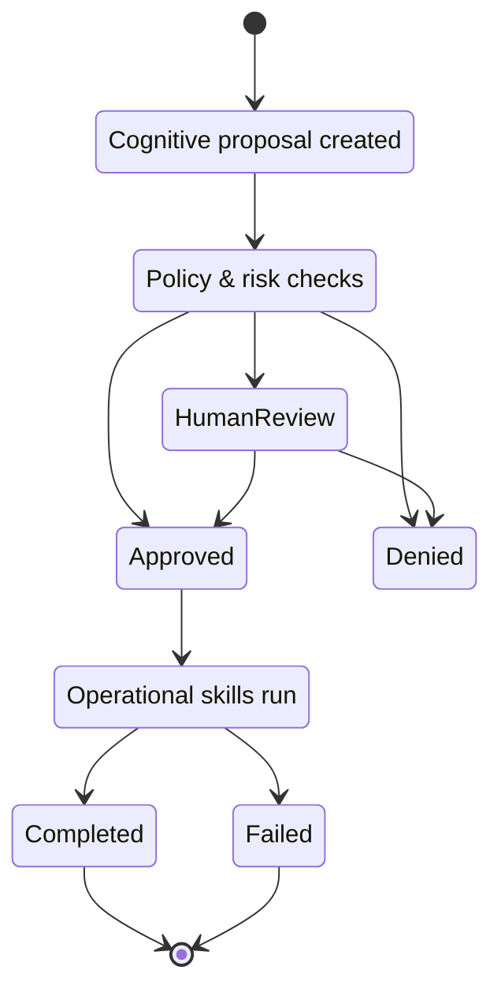

# 🤖✨ Clawdbot vs Next‑Level Personal AI

**Why the future is not one powerful agent, but a governed system of agents**

---

## 🌍 Introduction

Over the last months, tools like *clawdbot* have generated massive excitement. On platforms like X, it is often described as *the first real personal AI assistant* — something that can reason, browse, write, send emails, and take action on your behalf.

That excitement is understandable.

clawdbot demonstrates something important:

> 🧠 When an LLM is combined with tools, memory, and autonomy, it *feels* like intelligence.

But it also demonstrates something equally important:

> ⚠️ Unbounded autonomy is unsafe — not because the model is evil, but because systems lack structure.

This article argues that clawdbot is not the end‑state of personal AI, but an **early, monolithic prototype**. The next level requires orchestration, separation of concerns, contracts, audits, and explicit governance.

---

## ✅ What clawdbot gets right

clawdbot is impressive because it:

* 🧠 Combines reasoning and execution
* 🗂️ Has long‑lived memory
* 🛠️ Uses skills (browser, email, files)
* 🔄 Operates continuously, not per‑prompt

This makes it *feel* like an assistant rather than a chatbot.

But architecturally, clawdbot is a **single agent that thinks and acts in the same process**.

That design choice is exactly where the problems begin.

---

## 🚨 The core problem: no trust boundaries

In clawdbot:

* The same entity decides *what* to do
* And directly performs *how* to do it

This means:

* ❌ No reliable guardrails
* ❌ No enforceable scope
* ❌ No policy choke points
* ❌ No clean audit trail

You are forced to either:

* Fully trust the agent
* Or not run it at all

That is not how safe systems are built.

---

## 🧠➡️⚙️ The next level: Orchestrated agent architecture

The key insight is simple:

> **Reasoning and execution must be separated.**

Instead of one autonomous agent, we design a *system*:

* 🧩 A trusted **Orchestrator**
* 🧠 Untrusted **Cognitive agents**
* ⚙️ Untrusted **Operational agents**
* 📜 Explicit **contracts** between them
* 🔐 Mandatory **audit and logging**

---

## 🏗️ High‑level architecture



---

## 🧩 Cognitive vs Operational agents

### 🧠 Cognitive agent (untrusted)

**Responsibilities:**

* Reasoning
* Planning
* Comparing past vs present
* Proposing actions

**Constraints:**

* 🚫 No browser
* 🚫 No filesystem
* 🚫 No credentials
* 🚫 No direct side effects

**Output:**

* A structured, auditable **proposal**

Example:

* *“Create weekly report and email owner”*

---

### ⚙️ Operational agent (untrusted)

**Responsibilities:**

* Execute *approved* tasks
* Use browser, APIs, or files
* Perform deterministic actions

**Constraints:**

* 🚫 No planning
* 🚫 No goal creation
* 🚫 No memory of intent
* ✅ Only receives approved contracts

**Example skills:**

* Edit Google Docs
* Send Gmail
* Upload files

---

## 📜 Contracts: the safety backbone

Every action flows through a **contract**.

A contract explicitly declares:

* Inputs
* Outputs
* Side effects
* Required permissions

Example (conceptual):

```json
{
"skill": "send_email",
"recipient": "[owner@example.com](mailto:owner@example.com)",
"attachments": ["weekly_report"],
"side_effects": ["send_single_email"]
}
```

If a skill cannot declare its side effects, it is not allowed to exist.

---

## 🔐 Audit & policy gate

Before any execution:

* ✅ The proposal is validated against schema
* 🔍 Policies are applied
* ⚠️ Risk is classified

**Possible outcomes:**

* 🟢 **Approved** → execution allowed
* 🔴 **Denied** → execution blocked
* 🧑‍💻 **Human review** → escalation

Human‑in‑the‑loop is not a failure — it is a valid system state.

---

## 📊 Logging & observability

Logs exist at three layers:

1. 🧠 **Intent log** (cognitive output)
2. 🔐 **Decision log** (audit & approval)
3. ⚙️ **Execution log** (operational result)

This enables:

* Post‑mortems
* Replay
* Debugging
* Compliance

Monolithic agents cannot provide this cleanly.

---

## 🧪 Using clawdbot safely inside this architecture

clawdbot can still be useful — *if treated as untrusted*.

A safe pattern:

* 🧠 clawdbot‑cognitive → planning only
* ⚙️ clawdbot‑operational → execution only
* 🧩 Orchestrator → policy, control, identity

clawdbot becomes:

> 🎓 A powerful but reckless intern, surrounded by management and compliance.

---

## 🚀 Why this scales beyond clawdbot

This architecture works even if:

* clawdbot is replaced
* The LLM changes
* Tools evolve
* Models improve

Because safety is not embedded in prompts — it is embedded in **structure**.

---

## 🧭 Conclusion

clawdbot shows *what is possible*.

But the future of personal AI is not a single autonomous agent.

It is a **governed system**:

* 🧠 Separation of cognition and execution
* 📜 Explicit contracts
* 🔐 Auditable decisions
* 🧑‍💻 Human authority

The next level of personal AI will not be more intelligent.

It will be **more controlled**.

---

## 🔁 Agent lifecycle: from idea to action

The following diagram shows the **full lifecycle** of a governed agent task — from initial idea to execution and review.



---

## 🧯 Sidebar: Why prompt guardrails are not enough

It is tempting to believe that *better prompts* or *stricter system instructions* can make autonomous agents safe.

They can help — but they are **not sufficient**.

Why?

* Prompts are *advisory*, not enforceable
* Models can hallucinate or reinterpret instructions
* There is no hard stop once tools are invoked

Prompt guardrails fail silently.

**Structural guardrails fail safely.**

That is why this architecture does not rely on:

* "Please be careful" prompts
* Long system messages
* Hope-based alignment

Instead, it relies on:

* Separation of concerns
* Explicit contracts
* External audit and veto points

---

## 📄 Concrete example: Weekly research report agent

Let’s make this tangible with a real example.

### 🧠 Cognitive phase (planning only)

**Inputs:**

* Last week’s report
* New research notes
* Current goals

**Cognitive output (proposal):**

```json
{
"task": "weekly_report",
"actions": [
{
"skill": "update_google_doc",
"input": "report_content_v7"
},
{
"skill": "send_email",
"recipient": "[owner@example.com](mailto:owner@example.com)"
}
],
"risk": "low",
"confidence": 0.84
}
```

This proposal contains **no execution** — only intent.

---

### 🔐 Audit phase (decision)

The orchestrator evaluates:

* Are the requested skills allowed?
* Is email frequency within limits?
* Is the data scope correct?

**Outcome:** Approved ✅

---

### ⚙️ Operational phase (execution only)

Approved contracts are passed to the operational agent:

* Google Docs is opened
* The report is updated
* One email is sent

The agent cannot:

* Add new recipients
* Share additional folders
* Invent new tasks

---

### 📊 Result

* A Google Doc is updated
* A single email is sent
* Logs capture intent, approval, and outcome

At no point did one agent both *decide* and *act*.

---

These additions complete the picture:

* The **state diagram** shows control flow
* The **sidebar** explains why structure matters more than prompts
* The **example** demonstrates real-world safety in practice

This is what makes the architecture practical — not just principled.

---
_Last updated: January 2026_  
_Source: Cantaloop Aps._
