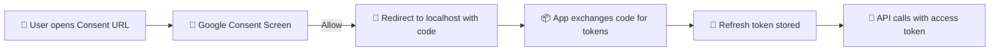

# 🔐 OAuth 2.0 with Google APIs — From “Magic” to Mental Model ✨

I recently went through a full OAuth 2.0 setup for a brand-new Google account, enabling **Gmail**, **Drive**, **Docs**, and **Sheets** API access.

Everything worked flawlessly —  
but it *felt* a bit like magic 🪄

This post is my attempt to:
- demystify what actually happened
- explain why OAuth feels opaque the first time
- show how developers usually avoid dealing with this more than once

---

## 🧱 The Setup (What I Actually Did)

### ☁️ Google Cloud Console

1. Created a new project
2. Enabled APIs:
   - 📧 Gmail API
   - 📁 Google Drive API
   - 📝 Google Docs API
   - 📊 Google Sheets API
3. Created an **OAuth 2.0 Client ID** (Desktop App)
4. Configured the OAuth consent screen:
   - App name
   - External audience
   - Published to production
   - Scopes did **not** require verification ✅
5. Downloaded the OAuth client JSON

---

### 🔁 The OAuth Flow

1. Used the client JSON to construct a **consent URL**
2. Opened the URL and approved access
3. Got redirected to `http://localhost` with an authorization `code`
4. Exchanged the code for tokens
5. Stored the **refresh token**
6. Successfully accessed Gmail, Drive, Docs, and Sheets APIs 🎉

Google now shows my app under **Third-party connections**, and I can revoke access at any time.

---

## 🤔 Why This Feels Like Magic

OAuth *looks* complex because:

- 🔀 Redirects feel opaque
- 🔑 Tokens look scary
- 📚 Everyone says “just use the SDK”
- 🧾 Docs explain *what* to do, not *why*

But underneath, OAuth 2.0 (Google flavor) is just:

1. One **GET** request (consent)
2. One **redirect** (authorization code)
3. One **POST** request (token exchange)
4. Saving a JSON file

That’s it. No sorcery involved.

---

## 🧭 OAuth Flow — Visual Overview



---

## 🛠️ Building the Consent URL (No SDK, No Magic)

From the downloaded `client_secret.json`, you already have:

- `client_id`
- `auth_uri`
- `redirect_uris`

The consent URL is just:

```
https://accounts.google.com/o/oauth2/auth
  ?client_id=CLIENT_ID
  &redirect_uri=http://localhost
  &response_type=code
  &access_type=offline
  &prompt=consent
  &scope=SCOPE_1 SCOPE_2 ...
```

📌 Notes:
- Scopes are **space-separated**
- URL-encode spaces as `%20`
- `access_type=offline` → refresh token
- `prompt=consent` → force issuance

---

### 📚 Example Scopes

- `https://www.googleapis.com/auth/gmail.readonly`
- `https://www.googleapis.com/auth/drive`
- `https://www.googleapis.com/auth/documents`
- `https://www.googleapis.com/auth/spreadsheets`

Open the URL → click **Allow** → redirect happens.

---

## 🔄 Exchanging the Code for Tokens

After consent, the browser redirects to something like:

```
http://localhost/?code=4/0AbCdEfGhIj...
```

That `code` is exchanged for tokens via a simple HTTP POST:

```
curl -X POST https://oauth2.googleapis.com/token \
  -d client_id=CLIENT_ID \
  -d client_secret=CLIENT_SECRET \
  -d code=AUTH_CODE \
  -d grant_type=authorization_code \
  -d redirect_uri=http://localhost
```

Google responds with JSON:

```
{
  "access_token": "...",
  "expires_in": 3599,
  "refresh_token": "...",
  "scope": "...",
  "token_type": "Bearer"
}
```

✨ This is the entire “magic”.

---

## 🏆 The Refresh Token Is the Real Prize

- ⏱️ Access tokens expire (~1 hour)
- ♻️ Refresh tokens live until:
  - user revokes access
  - app is deleted
  - consent is replaced

Refreshing later is just another POST:

```
curl -X POST https://oauth2.googleapis.com/token \
  -d client_id=CLIENT_ID \
  -d client_secret=CLIENT_SECRET \
  -d refresh_token=REFRESH_TOKEN \
  -d grant_type=refresh_token
```

No browser. No UI. No drama.

---

## 🤯 Do Developers Really Do This Every Time?

**No. Absolutely not.**

Here’s how reality looks.

### 1️⃣ OAuth Is Done Once per Project

- painful once
- copy-pasted forever
- never touched again unless scopes change

OAuth is treated like database migrations.

---

### 2️⃣ SDKs Exist to Hide This

Libraries:
- build URLs
- start localhost listeners
- parse redirects
- store tokens

They don’t change OAuth — they just hide it.

---

### 3️⃣ OAuth Is Centralized in Teams

In real systems:
- one service handles OAuth
- everyone else consumes tokens
- most developers never see consent screens

OAuth becomes **infrastructure**, not app logic.

---

### 4️⃣ Production Often Uses Service Accounts

For server-to-server access:
- no browser
- no user
- no consent
- no refresh tokens

Just signed JWTs and IAM roles 🔐

---

## 🧠 Why It’s Still Worth Understanding

Even if you never do this manually again:

- 🛠️ Debugging OAuth failures gets easy
- 🔍 Scope issues stop being mysterious
- 🚫 Revocation suddenly makes sense
- 🧑‍⚖️ Security reviews stop being scary

Most importantly:

> OAuth is not authentication.  
> OAuth is **delegated API access encoded as JSON**.

Once that clicks, the magic disappears.

---

## ✨ Final Thoughts

OAuth feels complicated because it tries to solve:
- trust
- consent
- revocation
- least privilege
- cross-app access

But the protocol itself is simple.

Do it once by hand and you’ve seen behind the curtain 🎭  
Next time, you’ll happily let a tool do it for you 😄
