## 🌐 Private Tailscale Infrastructure Setup

*A secure guide to connecting MacBook, Work Laptop, and Remote Servers.*

This documentation outlines my private network configuration designed to eliminate public port exposure (specifically SSH/Port 22) while maintaining seamless access across different environments and providing secure entry for external consultants.

## 🏗️ Architecture

The following diagram illustrates how my devices interact via a **Tailscale Mesh**. Despite being on separate physical networks (Home, Office, Cloud), they communicate as if they were on the same local switch.

```mermaid
graph TD
    subgraph "Tailnet (Privat Mesh)"
        MB[💻 MacBook - Privat] <--> TS((Tailscale Engine))
        WP[💼 Windows Laptop - Work] <--> TS
        RS[🖥️ Remote Server - Linux] <--> TS
	end 

    subgraph "Internet (Blocked)"
        Hacker[🕵️ Hacker/Bot] --Port 22 closed in UFW --> RS
    end

    subgraph "Ekstern Access"
        CON[👨‍💻 Consultant] -- Node sharing --> TS
    end
```



## 🛠️ Configuration Details

1. **Identity & Authentication**

* **Identity Provider:** Google (Gmail). Selected for universal compatibility across Windows, macOS, and Linux.

* **Security:** MFA (Multi-Factor Authentication) is enforced at the Identity Provider level to protect the entire Tailnet.

2. **Remote Server Hardening (Linux)**

The server is secured using **UFW (Uncomplicated Firewall)** to eliminate "noise" and brute-force attacks from the public internet.

**Key Commands:**

```bash
# 1. Allow all traffic from the Tailscale interface
sudo ufw allow in on tailscale0

# 2. Close SSH access from the public internet (eth0)
sudo ufw delete allow 22/tcp

# 3. Verify status
sudo ufw status verbose
```
*Note: While Port 22 is closed to the public, SSH remains fully functional via the internal Tailscale IP (100.x.y.z).*

3. Client Devices

* **MacBook:** Installed via the *Standalone macOS variant.*
* **Work Laptop (Windows):** Configured to co-exist with corporate "bloatware" such as **Zscaler** and **Cisco Secure Client.** Tailscale successfully tunnels via Port 443 (HTTPS) to bypass most corporate firewalls.

## 🤝 External Consultant Access

When temporary access is required for a consultant, I follow a **"Least Privilege"** protocol:

1. Node Sharing: I share *only* the specific server via the **Tailscale Admin Console**, keeping my MacBook and other nodes invisible to the consultant.

2. Server-Side Auth: The consultant is added as a local Linux user without a password:

```bash
sudo adduser --disabled-password consultant_name
```
3. SSH Method: Authentication is handled either via the consultant's **Public Key** or via **Tailscale SSH** to eliminate manual key management.

4. **Revocation:** Once the task is complete, I simply delete the "Share" in the Tailscale dashboard, instantly severing the network path.

## 🛡️ Security & Privacy FAQ

* **What if Tailscale goes down?** I maintain emergency access via the VPS provider's Web Console (Out-of-band access).

* **Is Tailscale trustworthy?** Based in Toronto/NY and built on the WireGuard protocol. Much of the client code is Open Source, and all traffic is **End-to-End Encrypted.**

* **Does Tailscale log my data?** No. They only see network metadata (which nodes are online). They cannot inspect the actual content of your traffic.
