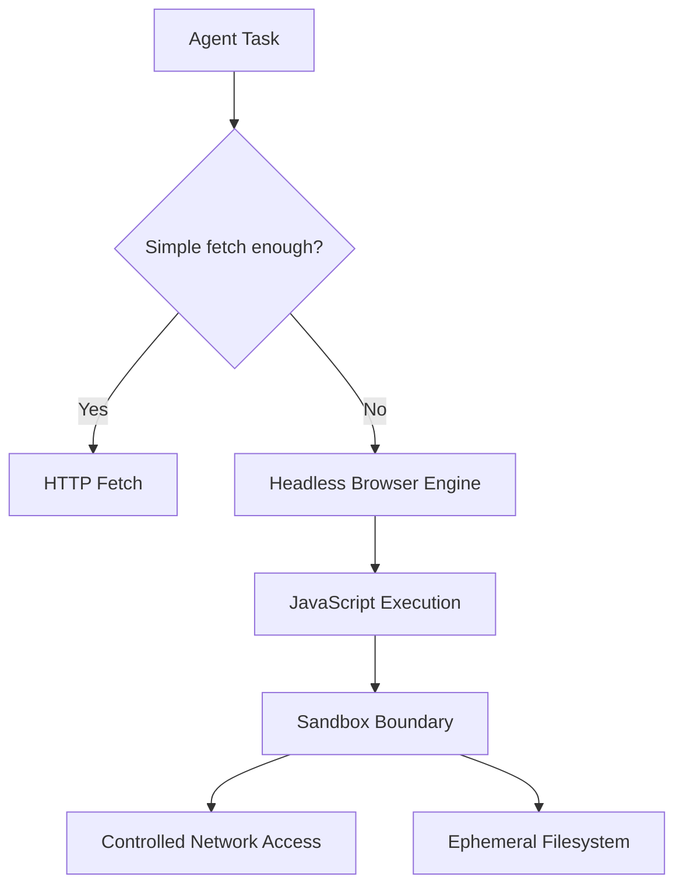
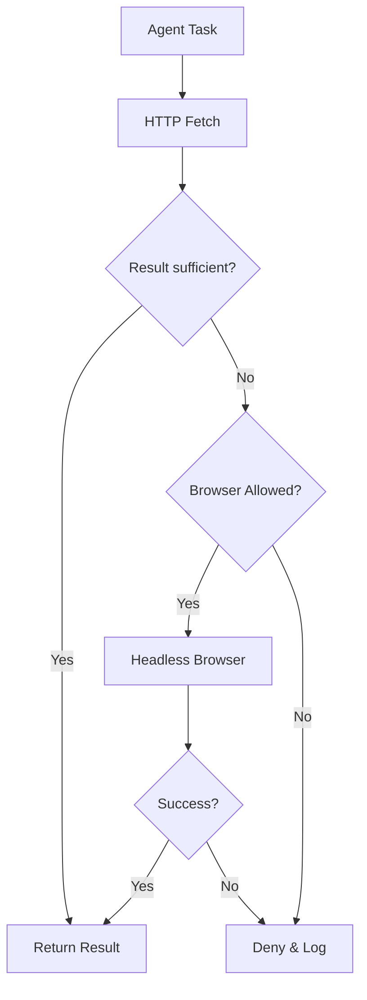

## Supporting Components: Browser Engines & Runtime Dependencies 🧩🌐

In headless agent-based systems (such as OpenClaw agents), **browser engines and related runtime components are not “set and forget” dependencies**. They sit in a grey zone between infrastructure, security tooling, and application runtime.

This section explains **who is responsible**, **why it matters**, and **how to manage it sanely**.

---

### Why a Browser Exists in a Headless System 🤔

Even without a GUI, modern web interactions require:

- JavaScript execution
- DOM rendering
- Cookie & session handling
- Anti-bot / fingerprint compliance
- OAuth and redirect flows

That means a **real browser engine** (Chromium / Chrome / Firefox) running in headless mode.

> Headless ≠ Browserless  
> Headless = *no UI, full engine*

---

### Who Is Responsible for Updating These Components? 🛠️

Short answer: **you are** — unless you explicitly outsource it.

In practice, responsibility depends on *how* the agent is deployed:

#### 1️⃣ Container-based agents (recommended) 🐳
- Browser version is pinned in the image
- Updates happen when:
  - Base image is rebuilt
  - CI pipeline refreshes dependencies
- **You control cadence**

✔ Predictable  
✔ Reproducible  
✔ Auditable  

---

#### 2️⃣ Host-installed browsers (like your Chrome fix) 🧯
- Browser is installed via OS package manager
- Updates handled by:
  - `apt`, `dnf`, `brew`, etc.
  - Or Chrome’s own auto-updater
- Agent simply *assumes* availability

⚠ Risk of silent breaking changes  
⚠ Harder to reproduce issues  

---

#### 3️⃣ Managed / platform agents ☁️
- Platform vendor updates browser engines
- You get:
  - Automatic security patches
  - Limited control over versions

✔ Low ops overhead  
❌ Less determinism  

---

### Why Chromium Often Breaks (and Chrome “Just Works”) 🧠

Common reasons Chromium fails in headless agent setups:

- Missing codecs or fonts
- Sandbox incompatibilities in containers
- Mismatched Playwright / Puppeteer expectations
- OS distro lagging behind Chromium releases

Chrome often works because:
- Google ships a **fully bundled, opinionated build**
- Better defaults for sandbox + headless
- Faster security patch cadence

Your choice was pragmatic, not dirty 👍

---

### Security Implications (Why Sandbox Config Matters) 🔐

Once a browser is present, the agent can:

- Execute untrusted JavaScript
- Process arbitrary HTML
- Open network connections

Therefore the browser **must** be sandboxed:

- Namespace isolation
- No persistent filesystem access
- No credentials mounted
- Restricted syscalls
- Controlled outbound network access

Failing to do this turns “web fetch” into **remote code execution**.

---

### Recommended Responsibility Model ✅

| Component | Owner |
|---------|------|
| Agent logic | You |
| Browser engine version | You |
| Sandbox policy | You |
| Auto-updates | CI / image rebuild |
| Emergency patches | Manual override |

---

### Reference Architecture (Headless Browser Agent) 🧱



---

### Practical Advice 💡

- Prefer **containerized browsers**
- Pin browser versions explicitly
- Rebuild images regularly (weekly / monthly)
- Treat browser engines like **part of your attack surface**
- Log browser version at agent startup
- Expect breakage — design for fast replacement

---
# Security & Operations Addenda for Headless Web Agents 🔐⚙️

This document contains operational and security extensions for agent-based systems that interact with the web using HTTP fetch and headless browsers.

It is intended to complement the main architecture documentation.

---

## 1. SECURITY.md Addendum 🔐

### Threat Model Overview

When an agent interacts with external web content, it is exposed to **untrusted code and data**.

Primary threat vectors include:

- Malicious JavaScript execution
- Token or credential exfiltration
- Network pivoting from browser context
- Filesystem access or persistence
- Browser sandbox escape vulnerabilities

The browser runtime must therefore be treated as a **hostile execution environment**.

---

### Mandatory Security Controls

The following controls are **required** when enabling headless browsers:

#### Execution Isolation
- Browser runs in a dedicated container or namespace
- No shared filesystem with agent logic
- Ephemeral runtime directories only

#### Privilege Restrictions
- No root execution
- Seccomp / AppArmor / SELinux where available
- Minimal syscall surface

#### Credential Hygiene
- No long-lived credentials mounted
- Tokens injected at runtime only
- Immediate teardown after task completion

#### Network Controls
- Outbound-only traffic
- Domain allow-list where possible
- No access to internal services or metadata endpoints

---

### Security Invariants (Non-Negotiable)

- Browser compromise must not imply host compromise
- Browser state must not persist between tasks
- Agent logic must remain isolated from browser runtime
- Failing closed is preferred over degraded security

---

## 2. Browser Update Runbook 🛠️🌐

### Purpose

Browsers are **fast-moving dependencies** with frequent security patches and breaking changes.  
This runbook defines how updates are handled safely and predictably.

---

### Update Strategy

#### Preferred Model: Containerized Browser
- Browser version pinned in container image
- Updates occur via scheduled rebuilds
- Rollback via previous image digest

#### Acceptable Model: Host-installed Browser
- Used only as fallback or emergency fix
- Requires explicit version logging
- Increased monitoring required

---

### Recommended Update Cadence

| Update Type | Frequency |
|------------|----------|
| Security patches | Weekly |
| Major browser versions | Monthly |
| Emergency CVEs | Immediate |

---

### Update Procedure

1. Bump browser version
2. Rebuild agent image
3. Run smoke tests:
   - Headless startup
   - JS execution
   - Sandbox validation
4. Deploy to staging
5. Observe for failures
6. Promote to production

---

### Rollback Procedure

- Revert to last known-good image
- Disable browser escalation if needed
- Switch agent to fetch-only mode temporarily

---

### Required Logging

At agent startup, log:
- Browser name
- Browser version
- Sandbox mode
- Container/image hash

---

### Screeshot from headless browser

Yes this is possible
- Example (Playwright / Puppeteer)

```js
await page.goto("https://example.com
", { waitUntil: "networkidle" });

await page.screenshot({
path: "debug.png",
fullPage: true
});
```

---

## 3. Agent Escalation Policy (Fetch → Browser → Deny) 🤖➡️🌐

### Principle of Least Capability

Agents must start with the **least powerful interaction model** and escalate only when required.

Escalation is **capability expansion** and must be explicit and auditable.

---

### Escalation Levels

#### Level 0 — HTTP Fetch ✅
Used when:
- Content is static
- API endpoints are available
- No JavaScript execution required

Allowed capabilities:
- GET / POST
- Header-based auth
- No JS, no cookies

---

#### Level 1 — Headless Browser ⚠️
Escalate only if:
- Required content loads via JavaScript
- Login/session handling is mandatory
- Fetch results are incomplete or empty

Additional requirements:
- Sandbox enabled
- Resource limits enforced
- Timeouts applied

---

#### Level 2 — Deny ❌
Escalation is denied when:
- Browser sandbox is unavailable
- Target domain is not allow-listed
- Required permissions exceed policy
- Risk outweighs task value

Agent must:
- Fail closed
- Emit structured error
- Avoid partial execution

---

### Escalation Decision Flow



---

### Auditing Requirements

For every escalation event, log:
- Task ID
- Escalation reason
- Target domain
- Browser version
- Sandbox mode
- Outcome

---

## Final Note 🧠

> The moment an agent gains a browser,  
> it stops being “just automation”  
> and becomes a **controlled execution platform**.

Design, document, and operate it accordingly.

---

### TL;DR 🧠

> If your agent can browse the web,  
> **you are now maintaining a browser platform** —  
> even if no one ever sees a window.
