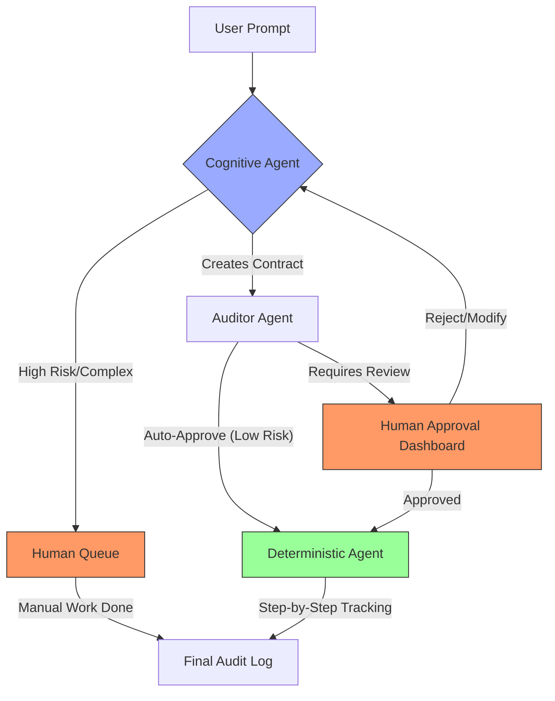

# Building the "Mini Orchestrator": The Future of Agentic AI Infrastructure 🤖🚀

The automation landscape is shifting. We are moving from the rigid, expensive world of traditional RPA (like UiPath) into a highly dynamic era of **Agentic AI**. But how do we manage these agents? How do we ensure they don't go rogue?

The solution is a **Layered Orchestrator** using **Cognitive**, **Audit**, and **Deterministic** agents, bound together by **Pydantic Contracts**, with a built-in safety net for human intervention.

---

## 🏗️ The Architecture: A Four-Layered Flow

To build a reliable "Mini Orchestrator," we split the labor into specialized layers:

### 1. The Cognitive Agent (The Planner) 🧠
It takes a messy human prompt: *"Rename all .txt files in /exchange to .txtx"*.
*   **Role:** Interpretation. It scans the environment and produces a structured plan.
*   **Classification:** It assesses the risk. If the task is high-stakes, it flags the status as `PENDING_HUMAN_APPROVAL`. If it's too complex for automation, it flags it for `MANUAL_EXECUTION`.

### 2. The Auditor Agent (The Gatekeeper) ⚖️
Before any code runs, a second, independent Agent reviews the contract.
*   **Role:** Safety & Compliance. It checks: *"Does the plan match the user's intent? Is it safe?"*
*   **Action:** If confidence is high, it approves. If there’s any doubt, it escalates to a Human.

### 3. Human-in-the-Loop (The Ultimate Authority) 👤
Our orchestrator isn't just "set and forget." It supports two critical human paths:
*   **Approval Gate:** A human reviews the AI's plan in a dashboard (e.g., Streamlit) and clicks "Approve."
*   **Manual Fallback:** If the AI is unsure, the task is routed to a human queue for manual handling, ensuring no work is lost.

### 4. The Deterministic Agent (The Doer) ⚙️
This is a reliable worker that reads the validated **Pydantic Contract**. It doesn't "think"—it just executes the API calls (e.g., Google Drive) with 100% precision and logs every single success or failure for the final audit trail.

---

## 📊 Visualizing the Agentic Workflow

Here is how a request travels through the Mini Orchestrator:



---

## 🤝 The Pydantic Contract: The Handshake

We use **Pydantic** to ensure the agents speak the same language. If the Cognitive Agent hallucinates, the contract simply won't validate, stopping the process before any damage is done.

```python
from pydantic import BaseModel, Field
from typing import List, Optional

# 📜 The Contract Schema
class RenameAction(BaseModel):
    old_name: str
    new_name: str

class FileWorkflowContract(BaseModel):
    folder_name: str
    actions: List[RenameAction]
    risk_level: str # 'low', 'medium', 'high'
    requires_human: bool = False
```

---
## 💾 Why use MariaDB as the Backbone? 🛡️

While tools like RabbitMQ are great for messaging, a database-backed queue (MariaDB) is superior for AI Agents because:
*   **State Management:** You can easily store `TO_BE_APPROVED` statuses for "Human-in-the-loop" workflows.
*   **Concurrency:** Using `SELECT ... FOR UPDATE SKIP LOCKED` allows multiple agents to work on the queue without collisions.
*   **Audit Logs:** You can store the entire "Thought Process" (JSON) alongside the result for 100% traceability.

---

## 💻 Code Example: The Cognitive Bridge

Using **OpenAI Structured Outputs**, we can force the AI to fill our Pydantic contract perfectly:

```python
from pydantic import BaseModel, Field
from typing import List
from openai import OpenAI

# 📜 The Contract
class RenameAction(BaseModel):
    old_name: str
    new_name: str

class FileWorkflowContract(BaseModel):
    folder_name: str
    actions: List[RenameAction]

# 🧠 The Cognitive Step
client = OpenAI()
completion = client.beta.chat.completions.parse(
    model="gpt-4o",
    messages=[{"role": "user", "content": "Rename all .txt in /exchange to .txtx"}],
    response_format=FileWorkflowContract,
)

# This structured JSON is now saved to our MariaDB Queue 📥
contract = completion.choices.message.parsed
```

---

## 💾 Why MariaDB as the Backbone? 🛡️

By using a simple SQL table with `SELECT ... FOR UPDATE SKIP LOCKED`, we get:
*   **State Management:** Easy handling of `TO_BE_APPROVED` and `MANUAL_PENDING` statuses.
*   **Audit Memory:** We store the original prompt, the AI plan, the Auditor's notes, and the execution logs in one single row.
*   **Transparency:** A simple dashboard can show exactly where an agent is stuck.

---

## 🌟 Why This Matters

By separating **Thinking**, **Auditing**, and **Doing**, we achieve:
1.  **Safety:** No "Black Box" executions. Everything is planned and validated.
2.  **Scalability:** Humans only intervene when necessary (Exceptions/High-risk).
3.  **Governance:** You get a full, legally defensible audit trail of every AI decision.

The future of automation isn't just one big bot; it's a fleet of specialized agents coordinated by a smart, contract-based Orchestrator. 🌐💡

#AI #Automation #Python #Pydantic #Orchestration #AgenticAI #SoftwareArchitecture #HumanInTheLoop

---

_Last updated: February 2026_  
_Sourc