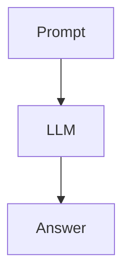
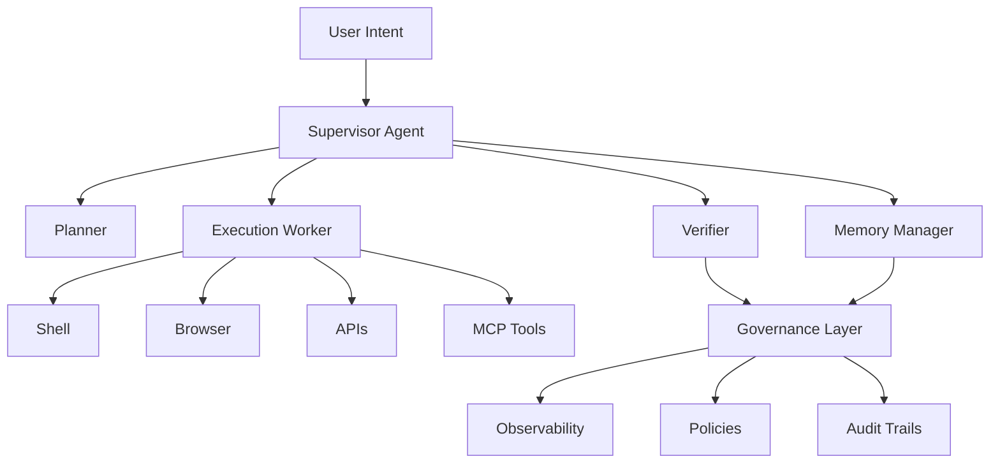
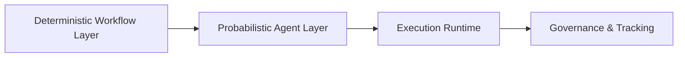
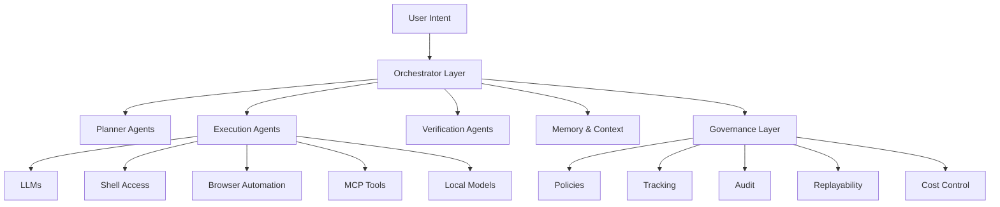

# 🚀 State of Agentic AI — May 2026

*A personal recap on orchestration, multi-agent runtimes, deterministic execution, and the evolving AI ecosystem.*

---

# 🌍 The Shift Has Happened

Over the past 12–18 months, the AI industry quietly crossed an important line.

We are no longer primarily building **chatbots**.

We are building:
- execution systems
- autonomous workers
- orchestrated runtimes
- persistent agent ecosystems
- probabilistic infrastructure layers

The biggest misconception around Agentic AI in 2025 was that it was about:

> “making the model smarter”

But by May 2026, it has become increasingly obvious that the real challenges are now:
- orchestration
- governance
- execution isolation
- observability
- state management
- memory partitioning
- economic optimization
- deterministic overlays

In many ways, modern Agentic AI is starting to resemble:
- distributed systems engineering
- workflow runtimes
- cloud orchestration
- operating systems for probabilistic workers

---

# 🧠 The New Mental Model

The industry has shifted from this:

To this:

The LLM is no longer “the product”.

The LLM is increasingly becoming:

> a runtime intelligence component inside larger execution systems.

---

# ⚙️ Multi-Agent Systems Are Real Now

The biggest leap in 2026 is that multi-agent execution is no longer theoretical.

Agents are now capable of:
- spawning sub-agents
- delegating work
- running asynchronously
- coordinating specialized workers
- persisting execution state
- interacting with tools autonomously
- operating over longer time horizons

However, the reality is still messy.

Current systems still suffer from:
- runaway loops
- hallucinated plans
- recursive failure states
- exploding context windows
- token burn
- inconsistent memory
- “vibe-driven execution”

The industry has realized something important:

> Pure autonomous agents are not production systems.

And this realization is driving the next architectural wave.

---

# 🏗️ The Rise of the Orchestrator Layer

This is where things become genuinely interesting.

The future likely belongs less to:

> “one super intelligent agent”

And more to:

> orchestrated ecosystems of specialized probabilistic workers.

The orchestrator layer is rapidly becoming the real battlefield.

Core responsibilities now include:
- execution routing
- lifecycle management
- memory partitioning
- governance enforcement
- policy control
- budget handling
- observability
- replayability
- deterministic overlays
- hybrid execution management

This starts to look surprisingly similar to:
- Kubernetes
- Airflow
- Temporal
- distributed workflow engines

…except now the workers are stochastic.

---

# 🔒 Deterministic AI Is Becoming Essential

One of the biggest industry realizations in 2026 is this:

> Enterprise AI requires bounded autonomy.

The trend is moving toward hybrid systems:

The winning architectures increasingly combine:
- deterministic workflows
- probabilistic reasoning
- policy enforcement
- replayable execution
- observability hooks
- approval gates

This is likely where the next generation of enterprise agent platforms will emerge.

---

# 🔥 OpenAI — From Chat Models to Execution Fabric

OpenAI’s biggest shift over the past 6 months has been moving beyond “AI assistants” and into:

> runtime-centric execution systems.

The modern Codex ecosystem is no longer just code generation.

It is evolving into:
- cloud-hosted execution
- isolated runtime environments
- multi-agent orchestration
- delegated task execution
- persistent background workflows
- execution sandboxes

The most important architectural direction is not the model itself.

It is:
- execution graphs
- runtime isolation
- async task orchestration
- structured sub-agent flows

OpenAI increasingly feels like it is building:

> the operating system layer for AI workers.

---

# 🧩 Anthropic — The Rise of Autonomous Coworkers

Anthropic has arguably become the reference point for serious long-form autonomous execution.

Claude Code changed the perception of what AI agents could realistically do.

The key breakthroughs have been:
- repository-scale reasoning
- long-running execution loops
- iterative self-correction
- deep tool integration
- autonomous coding workflows

Anthropic has leaned heavily into:
- “computer use”
- terminal execution
- browser interaction
- persistent agent workflows

Their systems increasingly behave less like assistants and more like:

> autonomous technical coworkers.

What stands out most is execution stability during long sessions.

Claude currently excels at:
- maintaining context coherence
- repository comprehension
- cautious execution behavior
- iterative refinement

---

# ☁️ Google Gemini & Spark — The Agent Ecosystem Vision

Google’s strategy may actually be the most ambitious.

Rather than building “a better assistant,” Google appears focused on:

> planetary-scale agent infrastructure.

The most important concepts emerging from Google are:
- persistent cloud agents
- Agent-to-Agent (A2A) communication
- enterprise agent fabrics
- cross-runtime interoperability
- large-scale orchestration
- policy-aware execution systems

Gemini Spark represents an important shift toward:
- always-on agents
- background execution
- user-bound persistent runtimes
- cloud-native autonomy

Google increasingly feels like it is attempting to build:

> Kubernetes for AI agents.

---

# 🔌 MCP vs Computer Use — The Split in the Industry

One fascinating trend in 2026 is the split between two execution philosophies.

## 1️⃣ Structured Tool Ecosystems (MCP)

Focused on:
- typed interfaces
- contracts
- governance
- policy enforcement
- enterprise integrations
- observability

## 2️⃣ Computer Use / Shell Agents

Focused on:
- terminal access
- browser automation
- filesystem interaction
- unrestricted flexibility
- high execution freedom

The second category is incredibly powerful.

But it is also:
- chaotic
- difficult to govern
- difficult to audit
- harder to secure

The future likely belongs to hybrid systems that combine both approaches.

---

# 🌐 Open Source Has Exploded

The open-source ecosystem is moving at incredible speed.

Projects like:
- OpenClaw
- OpenHands
- SWE-agent
- MetaGPT
- LangGraph ecosystems
- local LLM runtimes

…have accelerated experimentation dramatically.

But fragmentation is becoming a serious challenge.

The ecosystem currently suffers from:
- duplicated tooling
- incompatible abstractions
- unstable execution layers
- weak governance
- security inconsistencies

This creates a huge opportunity for:
- orchestration layers
- governance platforms
- observability systems
- runtime standardization

---

# 🧬 Local LLMs Are Quietly Becoming Critical

Local models are no longer just hobbyist experiments.

They are increasingly valuable for:
- privacy-sensitive execution
- low-latency routing
- deterministic classification
- offline systems
- sovereign AI strategies
- low-cost orchestration layers

The most promising architectures now combine:
- frontier models for reasoning
- local models for routing/filtering
- specialized models for narrow tasks

The future appears increasingly heterogeneous.

---

# 📈 The New Stack of Agentic AI

---

# 🧠 Final Reflection

The most important realization in May 2026 is this:

Agentic AI is no longer primarily about prompts.

It is about:
- execution systems
- orchestration
- runtime engineering
- governance
- lifecycle management
- stateful infrastructures
- distributed probabilistic workers

The winners over the next few years may not be the companies with:

> the single smartest model

But the companies that build:
- the best runtimes
- the best orchestration layers
- the best governance systems
- the best execution fabrics

We are entering the era of:

> AI runtime engineering.

And this is only the beginning.

---

*May 2026*

