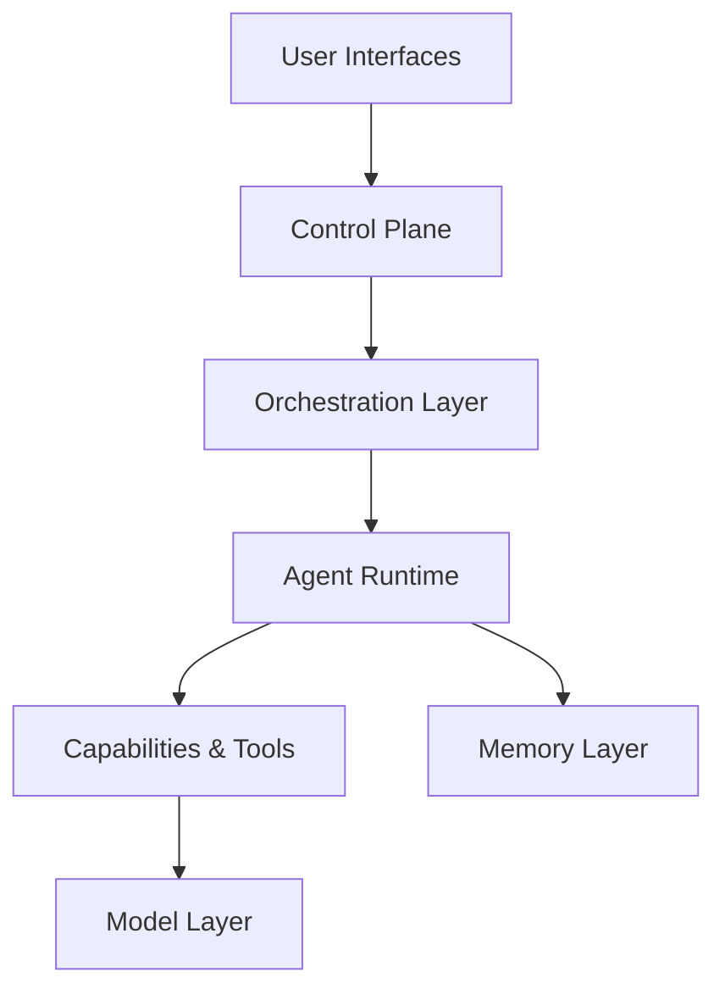
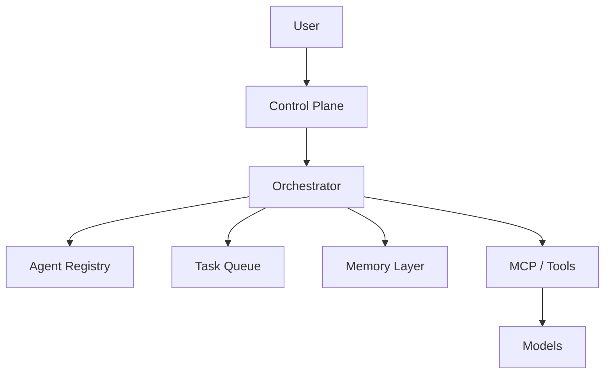

# 🤖 Agentic AI in 2026: The Shift from Agents to Orchestration

*My observations after following the ecosystem closely during the last 6-12 months.*

The AI industry is moving incredibly fast.

Just a year ago, most discussions were about building individual AI agents. Today, the conversation has shifted significantly. Agents are still important, but they are increasingly becoming a commodity. The real innovation is happening one layer above them.

The most interesting developments in 2026 are no longer about creating yet another agent.

They are about:

* Agent orchestration
* Agent teams
* Agent routing
* Shared memory
* Governance
* Observability
* Human approval workflows
* Model selection and optimization

In other words, we are slowly moving from **AI Agents** toward **AI Operating Systems**.

---

# 📈 The Evolution of Agentic AI

In 2024, many projects looked like this:

```
User
↓
Single Agent
↓
Tools
```

In 2026, the architecture increasingly looks like this:

```
User
↓
Control Plane
↓
Orchestrator
↓
Agent Team
↓
Tools + Memory + Models
```

The difference is significant.

Instead of one agent trying to do everything, modern systems increasingly consist of multiple specialized agents coordinated by an orchestration layer.

---

# 🗺️ The Agent Ecosystem Map (2026)

The ecosystem has become much easier to understand when viewed as layers.



## User Interfaces

This is where users interact with the system.

Examples:

* ChatGPT
* Claude
* Gemini
* Cursor
* Open WebUI
* OpenClaw
* Custom Dashboards

---

## Control Plane

This layer is becoming increasingly important.

Responsibilities include:

* Governance
* Human approval
* Monitoring
* Cost management
* Scheduling
* Security
* Agent routing

Many organizations are discovering that controlling agents is often harder than building them.

---

## Orchestration Layer

This is where agent coordination happens.

Major players include:

* OpenAI Agents SDK
* LangGraph
* CrewAI
* AutoGen / AG2
* Google ADK

This layer decides:

* Which agent should perform a task
* How work is delegated
* How results are combined
* How failures are handled

---

## Agent Runtime

The runtime layer executes agents.

Examples:

* Supervisor agents
* Worker agents
* Long-running agents
* Event-driven agents

A common pattern is:

```
Supervisor Agent

├── Research Agent
├── Coding Agent
├── Review Agent
└── Documentation Agent
```

This pattern appears repeatedly across vendors.

---

## Capability Layer

This is where agents interact with the outside world.

Capabilities include:

* APIs
* Databases
* Browser automation
* File systems
* Terminal access
* MCP servers

This layer is rapidly becoming standardized.

---

## Memory Layer

Modern agent systems increasingly rely on:

* Vector databases
* RAG systems
* Session memory
* Long-term memory
* Knowledge graphs

Memory is becoming a first-class citizen instead of an afterthought.

---

## Model Layer

The orchestrator can choose between:

* GPT models
* Claude models
* Gemini models
* Llama
* Qwen
* DeepSeek
* Mistral

The future is increasingly multi-model.

---

# 🔌 Is MCP Already Becoming Obsolete?

This is one of the most interesting discussions happening right now.

At first glance, it may appear that MCP (Model Context Protocol) is losing momentum because many agent systems now simply use terminal access.

For example:

* Claude Code
* OpenClaw
* OpenHands
* Codex

often solve problems directly through:

```bash
git
docker
curl
grep
find
pytest
```

Instead of calling highly structured APIs.

So why would MCP still matter?

The answer is simple.

Terminal access works extremely well for:

* Developers
* DevOps engineers
* Homelab enthusiasts
* Builders

However, large organizations often require:

* Permissions
* Auditing
* Governance
* Fine-grained access control

A bank will never give an AI unrestricted shell access.

A bank may expose:

```
GetCustomer()
CreateTicket()
TransferFunds()
```

through controlled interfaces.

This is where MCP becomes valuable.

My current view is that both approaches will coexist.

### Builder World

```
Terminal
Browser
Filesystem
```

### Enterprise World

```
MCP
Governance
Permissions
Auditing
```

MCP increasingly feels like the USB-C connector for AI integrations.

---

# 📝 The Rise of Agent Memory Files

One of the most unexpected developments has been the popularity of markdown-based memory files.

Many systems now rely on files such as:

* CLAUDE.md
* AGENTS.md
* copilot-instructions.md
* .cursorrules

At first, this feels surprisingly primitive.

But it solves a real problem.

Agents need persistent context.

A typical example:

```md

# Architecture

Backend:

* FastAPI
* PostgreSQL

Rules:

* Never use raw SQL
* Use repository pattern

Testing:

* Pytest only
  ```

This creates a shared understanding across sessions.

---

# 🤝 Different Vendor Philosophies

Although everyone is building agents, their approaches differ.

## Anthropic

Anthropic is heavily investing in:

* Claude Code
* Subagents
* Parallel execution
* Repository memory

Their philosophy feels very developer-centric.

The repository becomes part of the agent's memory.

---

## OpenAI

OpenAI increasingly focuses on:

* Agents SDK
* Handoffs
* Tracing
* Guardrails
* Observability

Agents are often defined directly in code.

```python
ResearchAgent()
CodingAgent()
QAAgent()
```

OpenAI appears focused on production-ready orchestration.

---

## Google

Google's ADK introduces a different idea.

Instead of creating large agents, they focus on reusable skills.

```
WebSearchSkill
DatabaseSkill
AnalysisSkill
```

which are combined into larger workflows.

The approach feels similar to microservices.

---

# 🚀 The Most Important Trend: Observability

In 2024 the question was:

```
Can we make the agent work?
```

In 2026 the question is:

```
Why did the agent do that?
```

This shift is enormous.

Organizations increasingly need:

* Logs
* Traces
* Replays
* Checkpoints
* Approval workflows
* Cost tracking

Observability is becoming one of the most valuable parts of the stack.

---

# ☸️ The Next Step: Kubernetes for Agents

Personally, I believe the most interesting opportunity is not building another agent.

The opportunity is building systems that manage agents.

Imagine an Agent Registry:

```json
{
"name": "ResearchAgent",
"skills": [
"web_search",
"analysis",
"summarization"
],
"cost": "medium",
"speed": "fast"
}
```

An orchestrator could then decide:

```
Need research?
→ Claude Agent

Need coding?
→ GPT Agent

Need large context?
→ Gemini Agent

Need cheap batch work?
→ Local Llama
```

The user would not select the model.

The orchestrator would.

This starts looking remarkably similar to Kubernetes scheduling workloads across infrastructure.

---

# 🔮 Where I Think We Are Heading

The future architecture may look something like this:



In this architecture:

* Agents become interchangeable
* Models become interchangeable
* Skills become reusable
* Orchestration becomes the core value

This feels much closer to an operating system than a chatbot.

And that may be the most important shift happening in AI today.

---

# 🧪 Things I Want To Explore Next

To better understand where the ecosystem is heading, these are the experiments I plan to run next.

## 1. Claude Code Deep Dive

* Build a real project
* Use subagents
* Explore repository memory
* Test parallel workflows

This currently appears to be one of the strongest developer-focused agent experiences available.

---

## 2. Gemini Agent Development Kit (ADK)

* Build skill-based agents
* Explore workflow composition
* Compare skills versus role-based agents

Google's approach feels fundamentally different and worth understanding.

---

## 3. OpenAI Agents SDK

* Experiment with handoffs
* Build supervisor-worker patterns
* Test tracing and observability

I suspect many enterprise-grade systems will be built on similar concepts.

---

## 4. Build a Personal Agent Registry

Create a lightweight service that tracks:

* Agent capabilities
* Cost
* Latency
* Reliability

Then route tasks dynamically.

This would be a small step toward a true agent orchestrator.

---

## 5. Compare MCP versus Terminal-First Agents

Run the same workflows using:

* MCP tools
* Terminal access
* Browser automation

Compare:

* Reliability
* Flexibility
* Governance
* Development effort

---

## 6. Build an Agent Control Plane

Instead of building another agent:

Build the dashboard.

Track:

* Running agents
* Active tasks
* Costs
* Logs
* Traces
* Human approvals

This may be where the most interesting opportunities exist over the next few years.

---

# Final Thoughts

The biggest lesson from the last year is that agents themselves are becoming less interesting.

What is becoming interesting is everything around them:

* Orchestration
* Routing
* Governance
* Memory
* Observability
* Control planes

The industry is slowly shifting from building AI agents to building the operating systems that coordinate them.

And that may ultimately be where the largest opportunities emerge.
