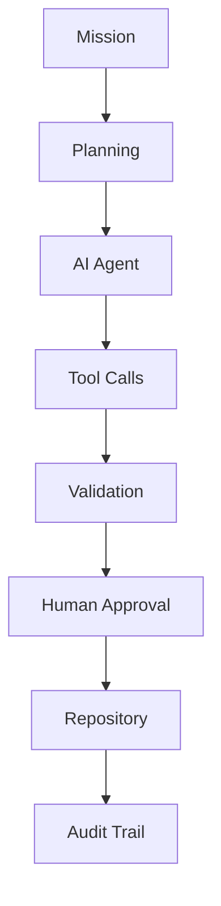

# 📂 Git Was Never only About Code

*What if Git becomes the foundation for trustworthy AI work?*

---

One thought has been stuck in my head recently.

Maybe...

**Git was never really about code.**

It was about **trust.**

---

# 🔍 What Git Actually Gave Us

When people think about Git, they usually think about version control.

I think it gave us something much bigger.

It gave us **transparency**.

Today, software engineering relies on concepts that have become second nature:

* 👤 Who made the change?
* 🕒 When was it made?
* 💬 Why was it made?
* 🔀 Which branch was used?
* 👀 Who reviewed it?
* ✅ Which tests passed?
* 🚀 Which version is in production?
* ⏪ Can we roll it back?

That isn't just source control.

That is **trust engineering.**

---

# 🤖 AI Agents Need The Same Foundation

Now imagine an AI workforce.

An agent:

* Updates Salesforce
* Creates a PowerPoint
* Edits a contract
* Writes a report
* Sends notifications
* Updates a CRM system

How do we know:

* Why it did it?
* What information it used?
* Whether someone approved it?
* Whether policies were respected?
* Whether another agent verified the work?

Exactly the same questions we ask software engineers.

---

# 🔄 From Source Control to Work Control

Perhaps Git evolves into something much larger.

Not simply storing code.

But storing **work.**



Every mission leaves evidence.

Every decision becomes reviewable.

Every action becomes reproducible.

---

# 📁 Imagine Every AI Mission As A Repository

Instead of scattered logs across dozens of systems...

Imagine this.

```text
Quarterly Business Review/

├── mission.md
├── objective.md
├── context/
│   ├── crm_snapshot.json
│   ├── customer_notes.md
│   └── pricing_rules.json
│
├── outputs/
│   ├── report.docx
│   ├── presentation.pptx
│   └── executive_summary.md
│
├── approvals/
│   └── manager.json
│
├── audit/
│   ├── timeline.json
│   ├── tool_calls.json
│   ├── model_versions.json
│   └── costs.json
│
└── final_state.json
```

This isn't source code.

It's **knowledge work**.

Versioned.

Traceable.

Auditable.

---

# 📦 JSON Becomes The Universal Contract

One lesson from building agent systems keeps returning.

Agents shouldn't exchange paragraphs.

Agents should exchange **structured intent.**

```json
{
"mission": "...",
"status": "validated",
"confidence": 0.94,
"requiresApproval": true,
"nextAction": "...",
"artifacts": [...]
}
```

Humans can read it.

Agents can process it.

Repositories can version it.

Governance can audit it.

---

# 👀 Pull Requests For Business

Software engineers don't push directly to production.

They submit Pull Requests.

Why shouldn't AI agents?

Imagine receiving something like this.

```text
CRM Update Proposal

✔ Update Customer Record

✔ Create Opportunity

✔ Schedule Follow-up

Confidence: 95%

Business Policies: Passed

Approval Required
```

The human isn't reviewing code.

The human is reviewing **intent.**

That's a Pull Request for business operations.

---

# 🏢 Business As Code

We've already embraced ideas like:

* ⚙️ Infrastructure as Code
* 🔐 Policy as Code
* ☁️ Configuration as Code

Perhaps the next step is:

* 📋 Workflow as Code
* 📚 Knowledge as Code
* 🎯 Decision as Code

Not because everything becomes software...

But because everything becomes **reviewable.**

---

# 👮 Governance Starts With Evidence

Governance isn't a dashboard.

Governance starts with evidence.

Imagine an auditor asking:

> Why did we approve a €250,000 customer discount six months ago?

Instead of searching:

* Emails
* Teams chats
* CRM history
* Meeting notes

You simply open the mission repository.

Everything is there.

✔ Original objective

✔ Context

✔ AI reasoning summary

✔ Tool usage

✔ Validation

✔ Human approvals

✔ Final outcome

One place.

One story.

Complete transparency.

ChangeOps to help AgentOps, LLMOps, AIOps to track intent, evidence, approvals, history aka the governance layer

---

# 🎼 Cantaloop

This is exactly where my **Cantaloop** experiments are heading.

Not building another chatbot.

Not building another LLM wrapper.

But exploring trustworthy orchestration.

* 🤖 Worker Agents
* 🎼 Orchestrator
* 🔄 Persistent Loops
* 🔌 MCP Tools
* 📦 JSON Handovers
* 🏠 Local LLMs
* ⚙️ Deterministic Workflows
* 👮 Governance
* 📋 Audit
* ✋ Human Approval
* 📈 Observability

Every autonomous mission should leave behind an auditable footprint.

Just like every software change leaves behind a Git history.

---

# 💡 A Thought

Maybe Git isn't the best tool because it stores code.

Maybe Git became successful because it stores **change.**

Code was simply the first thing we learned to version.

Tomorrow...

The contributors might look like this.

```text
Contributors

✔ Alice

✔ Bob

✔ Finance Agent

✔ Research Agent

✔ Compliance Agent

✔ CRM Agent
```

Some contributors happen to be human.

Some happen to be AI.

The principles remain exactly the same.

---

# 🚀 Final Thought

Software engineering didn't become trustworthy because developers became perfect.

It became trustworthy because we built systems that made every change transparent.

Maybe the next generation of AI systems doesn't need entirely new governance models.

Maybe we simply need to apply the same principles that transformed software engineering:

* 🌿 Branches
* 💬 Reviews
* 🔀 Pull Requests
* 📝 Version History
* 🔎 Audit Trails
* ✅ Approvals
* 📦 Structured Artifacts
* 🔄 Reproducibility

Perhaps the future isn't just **Git for Code.**

Perhaps it's **Git for Work.**

And that might become one of the most important building blocks for trustworthy AI.
