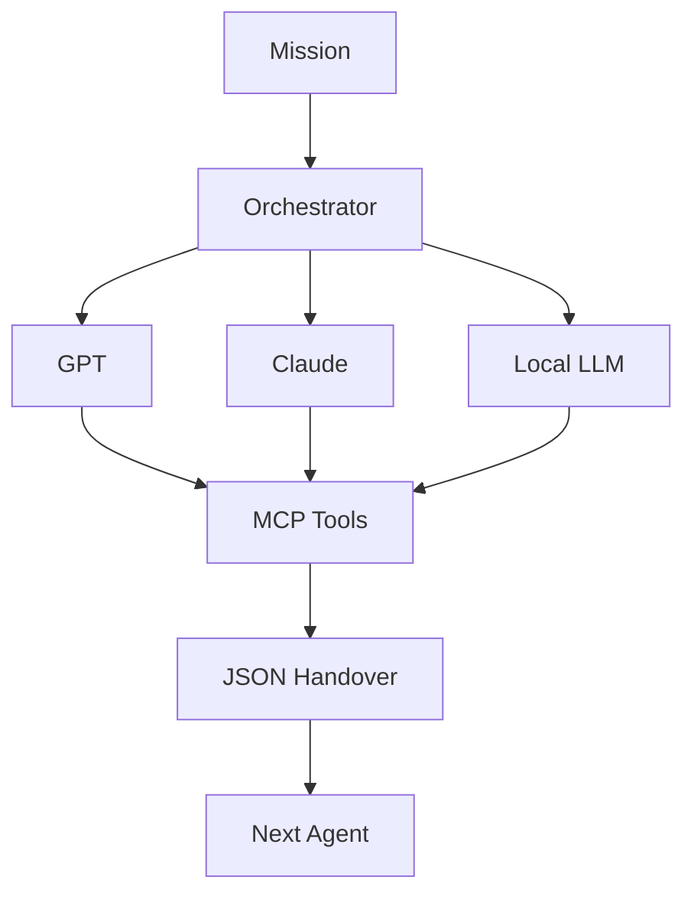
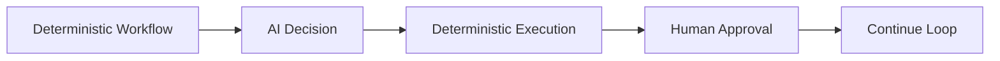
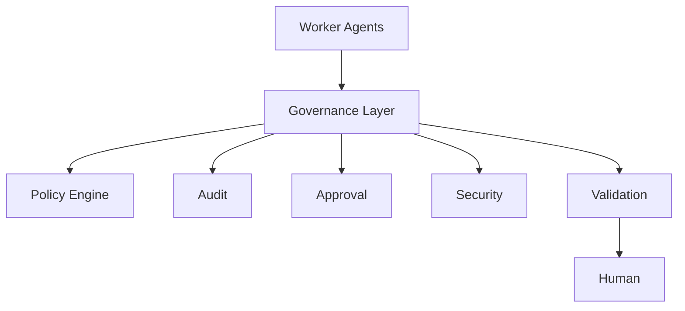

# 🔄 Cron is Dead. Long Live the Loop.

*Thoughts from AI Engineer World's Fair 2026, San Francisco*

---

One theme keeps appearing everywhere in the AI community right now.

**Loops.**

Not prompts.

Not models.

Not benchmarks.

**Loops.**

After watching several sessions from **AI Engineer World's Fair 2026** this week in San Francisco, it became obvious that many of the brightest minds are converging on the same idea. Andrej Karpathy has spoken about letting Claude "work for him" for extended periods rather than asking isolated questions.

That observation resonated deeply with me.

For the past months I have been experimenting with orchestrators, local LLMs, MCP, multi-agent collaboration and governance on my own little playground...

# **Cantaloop**

...and suddenly the name feels more relevant than ever.

---

# 🍈 Why Cantaloop?

Years ago I owned **Cantaloop.dk**.

I eventually sold the domain when an American clothing company wanted it as their brand.

Last year it unexpectedly became available again.

I bought it back immediately.

At the time I simply missed the name.

Today it has become something completely different.

Cantaloop is now my personal AI Lab for exploring what I believe is the next generation of AI systems.

The name even gained a new meaning:

* 🎵 A tribute to **Herbie Hancock's Cantaloupe Island**
* 🎧 A nod to **Us3's Cantaloop**
* 🔄 **Can + Loop** — persistent AI loops

Sometimes names find their purpose years later.

---

# 🤖 The Next Evolution

Our industry has evolved remarkably fast.

```text
Batch Jobs
↓
Cron
↓
Pipelines
↓
CI/CD
↓
Serverless Events
↓
LLMs
↓
Agents
↓
Persistent AI Loops
```

Notice something?

The model itself is no longer the most exciting part.

The **loop** is.

---

# 🧠 One Prompt vs Persistent Work

Yesterday's interaction looked like this:

```text
User
↓

Prompt

↓

LLM

↓

Answer

Done.
```

Tomorrow's interaction looks more like this:

```text
Objective

↓

Observe

↓

Plan

↓

Execute

↓

Verify

↓

Improve

↓

Continue...
```

The AI never really "stops".

It keeps observing.

It keeps reasoning.

It keeps improving until the mission is completed.

---

# 🔄 From Cron to Cognitive Loops

Cron was brilliant.

But Cron was also incredibly simple.

```bash
0 3 * * *

Run backup.sh
```

Future AI schedulers may instead look like this:

```text
Every hour

Read Git repositories

Look for improvements

Run tests

Create Pull Request

Wait for approval

Continue
```

Or perhaps:

```text
Every morning

Read emails

Read calendar

Read market news

Summarize priorities

Suggest actions
```

Or:

```text
Whenever a new UiPath release appears

Read release notes

Estimate impact

Update documentation

Prepare migration plan
```

Notice the difference?

The trigger is no longer just **time**.

The trigger is **continuous observation**.

---

# 🎼 An Orchestra, Not a Solo

Large Language Models are becoming musicians.

The orchestrator becomes the conductor.



Every component has a role.

No single model needs to do everything.

---

# 📦 JSON as the Universal Language

One concept I keep coming back to is extremely simple.

Agents should not exchange paragraphs.

Agents should exchange **structured knowledge**.

```json
{
"objective": "...",
"status": "completed",
"confidence": 0.91,
"artifacts": [...],
"next_action": "...",
"requires_approval": true
}
```

JSON becomes the contract between autonomous workers.

Simple.

Portable.

Deterministic.

Auditable.

---

# 🧰 MCP Changes Everything

Model Context Protocol (MCP) gives agents standardized access to tools.

Instead of teaching every model every API...

...the orchestrator simply exposes tools.

```text
Agent

↓

MCP

↓

GitHub
Filesystem
Database
Slack
Browser
REST APIs
```

The agent doesn't care how the tool works.

It simply knows how to use it.

---

# ⚙️ Deterministic Meets Cognitive

One of my favorite ideas is not replacing traditional automation.

Instead...

Combine them.



Traditional software is fantastic at executing known rules.

LLMs are fantastic at handling uncertainty.

The future combines both.

---

# 👮 Governance is Not Optional

This is probably where my enterprise background influences my thinking.

Many discussions around AI focus on intelligence.

I keep thinking about governance.

Every company already has:

* ✅ Audit
* ✅ Compliance
* ✅ Security
* ✅ HR
* ✅ Approvals
* ✅ Policies

Why shouldn't AI workers?

I imagine an architecture like this.



AI agents should not simply be smart.

They should also be accountable.

---

# ✈️ Every Agent Needs a Flight Recorder

When something goes wrong we rarely ask:

*"What were you thinking?"*

Instead we inspect evidence.

I would love every autonomous loop to produce something like this:

```text
Mission ID

Agent

Model Version

Prompt Version

Tools Used

MCP Calls

Tokens

Cost

Confidence

Validation Result

Approval Chain

Final Outcome
```

That's not just logging.

That's governance.

---

# 🏢 The Digital Workforce

Maybe we should stop thinking about AI as software.

Maybe we should start thinking about AI as employees.

```text
CEO

↓

Orchestrator

↓

Worker Agents

↓

Governance Agents

↓

Audit Agents

↓

Security Agents

↓

Human Oversight
```

Human organizations have evolved for hundreds of years.

Why wouldn't autonomous organizations borrow the same principles?

---

# 🚀 The Tiny Prototype

The funny part?

The first prototype doesn't need hundreds of agents.

It doesn't even need expensive infrastructure.

Imagine something as small as this:

```text
Loop starts

↓

Receive objective

↓

Worker Agent

↓

Use MCP Tool

↓

Produce JSON

↓

Validation Agent

↓

Approval?

↓

Continue

↓

Mission Complete
```

That's it.

No magic.

No hype.

Just one persistent loop.

One orchestrator.

A few tools.

One governance layer.

One human approval when required.

From tiny prototypes...

...great systems emerge.

---

# 🌍 Why This Excites Me

For years we automated processes.

Today we automate knowledge work.

Tomorrow we will orchestrate digital workforces.

Not replacing humans.

Working alongside them.

Safely.

Responsibly.

Continuously.

---

# 🎯 My Vision for Cantaloop

Cantaloop is not intended to become another LLM wrapper.

It is becoming a playground for ideas around:

* 🤖 Agentic AI
* 🔄 Persistent Loops
* 🎼 Orchestration
* 📦 JSON Handovers
* 🔌 MCP Tools
* 🏠 Local LLMs
* ⚙️ Deterministic + Cognitive Workflows
* 👮 Governance
* 📋 Audit
* 👁️ Observability
* ✋ Human Approval
* 🚀 Tiny Practical Prototypes

Not because every problem needs a thousand agents.

But because every trustworthy AI system deserves a solid foundation.

---

## Final Thought 💭

Large Language Models gave us intelligence.

Persistent loops give us autonomy.

Governance gives us trust.

I have a feeling that in a few years we won't be asking:

> *"Which model are you using?"*

We'll be asking:

> *"How is your loop designed?"*

And somehow...

**Cantaloop** suddenly feels like exactly the right place to explore that future.

Happy looping. 🔄🍈
