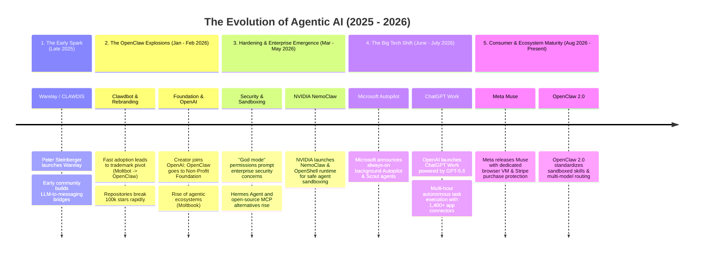

# 🔄 A lot has happened in the field of Agentic AI since Openclaw took off in December 2025

*trying to show timeline*

Tomorrow September 29, OpenAI will host Dev Day and most likely announce their product with Peter Steinburger being there

---

